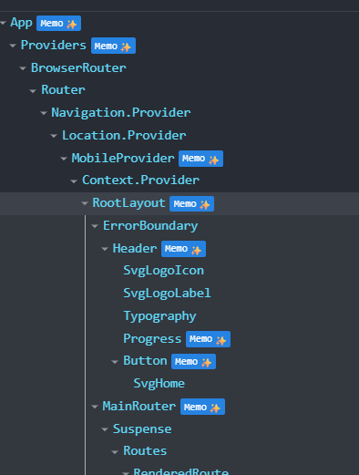
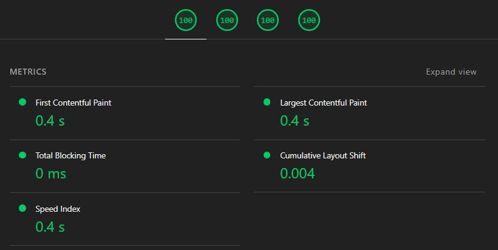

# Генерация сопроводительных писем с помощью AI

## Запуск

1. `yarn` - установка пакетов
2. `npm run dev` - запуск режима разработки

Если нужна сборка она делается так:

1. `npm run build` - сборка проекта
1. `npm run preview` - запуск сборки

## О проекте

### Технологии

1. `React` - Основной фреймворк
2. `Vite` - Сборщик
3. `Css Modules` - Стили
4. `Zustand` - Стейт менеджер
5. `Open AI` в качестве бизнесовой интеграции

### Архитектура

Проект хоть и небольшой но сделал в архитектуре [FSD](https://feature-sliced.github.io/).

#### `app`

Для хранения функционала относящегося ко всему приложению

#### `pages`

Для хранения страниц. Страницы желательно делать тонкими, чтобы основная логика была в widgets features и entities.

#### `widgets`

Для переиспользуемого полноценного блока со своей логикой.

#### `features`

Для хранения пользовательского взаимодействия.

#### `entities`

Для хранения бизнес сущностей. Часто эти сущности согласуются с сущностями бекенда. У нас это `application` и `open-ai`.

#### `shared`

Общий переиспользуемый код.

## Основные задания

#### 1. Приложение должно уметь восстанавливать сопроводительные письма, которые были созданы в этом же браузере

✅ `Zustand` связан с `localstorage` через `persist middleware`.

#### 2. В макетах специально не используется никакой дизайн-системы или готового React UI kit-а.

✅ В `src\shared\ui` хранится разработанный UI-kit который можно удобно заменить на какие либо библиотеки если потребуется.
✅ Также есть css переменные для удобного управления темой `src\app\styles\theme.css`

#### 3. В макетах отсутствует мобильная версия — вам нужно создать ее самостоятельно.

✅ Мобильная версия реализована, в качестве самого маленького экрана был взят `iPhoneSE` в `Chrome devtools`

#### 4. Для генерации писем можете использовать следующий шаблон письма (или любой другой по своему усмотрению):

Был взят более продвинутый вариант из дополнительных заданий

## Дополнительные задания

#### 1. Симулировать долгую (2-3 сек) генерацию текста и показать состояние загрузки, как показано в этом прототипе.

✅ Сделана симуляция и анимация загрузки

#### 2. Внедрить AI для написания писем

✅ Сделана интеграция с `OpenAI`

## На что мы будем обращать внимание при проверке

#### Понятность и масштабируемость кода

FSD подход в оформлении кода, в плане масштабируемости отличный вариант

#### Понимание дизайна и внимание к деталям, качество верстки и адаптивности

Кроме того что изображено на макетах я добавлял дополнительную логику например:

- добавил необходимые состояния кнопок: loading, disable, hover, active
- оживил иконку загрузки на кнопке
- проверял переполняемость контентом, инпутов, фиксил баги если были
- создал тему для удобства и понимания

#### Понимание React и следование best practices

В консоле нет ни ошибок ни варнингов.
Кроме базовых eslint, pritter, typescript и прочего к 19ому реакту прикрутил `react compiler` для улучшения производительности
Вот так выглядит когда что compiler работает =)

#### Структура проекта

Старался сделать все понятно и аккуратно. Конечно для такого небольшого вариант можно было бы взять подход проще и оформить код ещё понятнее, но я больше думал про потенциальную расширяемость, которая может случиться с любым проектом.

## Экстра штучки

### Редактирование

Кроме создания рекомендательного письма реализовал ещё и функцию его редактирования, кажется это необходимым минимумом для приложения. Считаю что это сильно улучшает пользовательский опыт.

### Обработка ошибок

1. `ErrorLogger` - сервис логирования, если нужно прикрутить Sentry это можно и нужно сделать только в одном месте
2. `setupGlobalErrorHandlers` - для подстраховки и перехвата глобальных ошибок
3. `ErrorBoundary` - для перехвата ошибок внутри компонентов, чтобы приложение продолжало частично работать при сбое, а не падало полностью с белым экраном

### Доступность

По всему приложению можно перемещатсья через таб без мыши

### Метрики

### 404 страница

Не сложно а пользователю приятно

## Что бы я обговорил с дизайнером (все минорное)

- в макетах желательно использовать размеры кратные 2 или 4, например в логотипе отступ между иконкой и "Alt+Shift 12.67px, я беру 12 (вообще больше я таких моментов не видел, поэтому вопрос можно опустить)
- ошибка: кнопка `Generate Now` при загрузке меняет размер с 60 на 56
- в кнопке с иконкой домика цвет иконки rgba(52, 64, 84, 1) в кнопке "copy to clipboard" rgba(71, 84, 103, 1) уточнить не ошибка ли это, потому что газом разницу почти не видно
- на главной странице при большом количестве карточек можно было бы закреплять Header а прокрутку делать только ниже, в блоке с карточками

 

> ### На этом всё!
>
> Благодарю за уделённое время и внимательное рассмотрение моего тестового задания. Это действительно важно для меня.
> Надеюсь эта работа зацепит вас и мы продолжим общение
> В любом случе я всегда расположен получать обратную связь и буду рад любому совету =)
